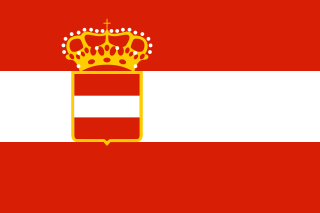
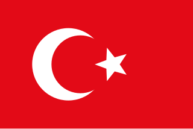
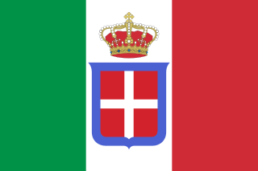
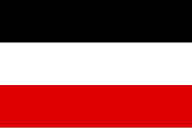

# Austria
            

Potencia terrestre

#### Primer objetivo

Capturar Serbia y Grecia

#### Consejos estratégicos

**Juego Temprano**

Austria es el más vulnerable al comienzo de la partida. Tú más que nadie deberás usar la diplomacia o algún evento externo para mejorar tu posición y asegurar tu supervivencia.

**Turquía**

Turquía y Austria casi siempre serán enemigos. Si se alían, Austria está en gran desventaja. Turquía podría llegar a controlar territorios en tres regiones (El Mediterráneo, Los Balcanes y Rusia). En este punto, Austria es un blanco fácil.

**Italia y Rusia**

Italia y sobre todo Rusia son tus mejores posibles aliados.

Si Rusia y Turquía se alían, Austria puede convencer fácilmente a Italia de que lo ayude a evitar ser aplastados por las potencias orientales.

**Alemania**

Alemania casi siempre aceptará un pacto de no agresión. Austria no debería desperdiciar sus ejércitos en occidente.

**Juego tardío**

Lamentablemente, Austria deberá en algún punto eliminar a Italia para ganar pues el mar y Alemania limitan la expansión hacia el norte. Eventualmente Austria deberá convertirse en una potencia naval.

#### Consejos tácticos para los primeros turnos

**Primavera 1901:**
* F TRI - ALB
* T BUD - SER 
* T VIE D

**Otoño 1901:**  El tanque en Serbia apoya el movimiento de la flota en Albania para así capturar ambos centros de suministros:
* T SER A F ALB - GRE
* F ALB - GRE
*
Utilza el tanque en Viena para bloquear al vecino (Rusia o Italia) que parezca amenazante escribiendo una de las siguientes:
* T VIE - GAL 
* T VIE - TRI 
* T VIE - TYR