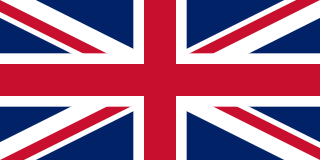
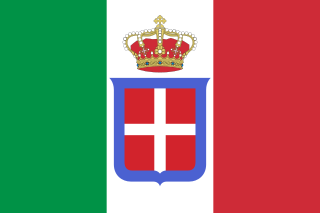

# Inglaterra

Potencia naval

#### Primer objetivo

Capturar Noruega

#### Consejos estratégicos

**Juego Temprano**

Inglaterra tiene una excelente posición defensiva pero perspectivas de expansión pobres

**Alemania**

Una alianza entre Inglaterra y Alemania no es tan difícil de mantener como una entre Austria y Turquía, pero tampocó será fácil. Al aliarse con Alemania Inglaterra debe moverse hacia el sur, sin embargo no puede evitar enfrentar a rusia en el norte, dejando la retaguardia Alemana completamente rodeada.

**Francia**

Una alianza entre Francia e Inglaterra puede ser beneficiosa, pero puede favorecer a Francia a la larga.

Cualquiera sea el aliado, Inglaterra puede llegar a capturar Bélgica.

**Italia y Rusia**

Inglaterra puede permitirse jugar pacientemente hasta que Italia o Rusia lleguen a occidente para atacar a Francia o Alemania. En cualquier caso, Inglaterra no debe quedarse atrás en la captura de territorios, de lo contrario podría ser aplastada por su ex aliado e Italia/Rusia.

**Juego tardío**

Inglaterra puede ganar conquistando Alemania y Rusia, sin embargo el frente oriental seguramente frenará su avance.
De forma similar, Inglaterra puede ganar mediante un avance hacia el sur hasta el meditarráneo. En este caso es más difícil para los defensores, establecer una linea defensiva.

Con seis o siete centros de suministros, inglaterra tiene muchas opciones para considerar.

#### Consejos tácticos para los primeros turnos

**Primavera 1901:**
* F LON - NTH
* F EDI - NOR
* T LIV - EDI

**Otoño 1901:**
El tanque puede ser cargado a través del mar por cualquier flota, mientras la otra interviene en alguna costa del continente.
